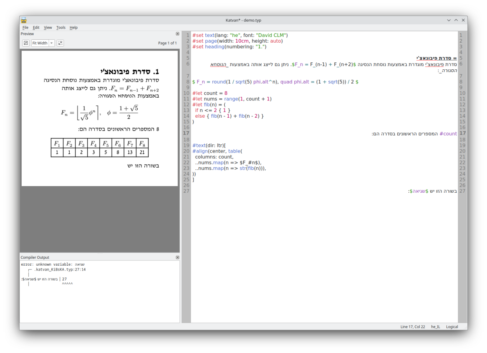
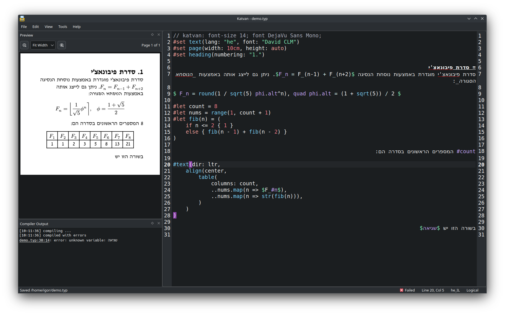

# Katvan

A bare-bones graphical editor for [Typst](https://github.com/typst/typst) files, with a strong bias for Right-to-Left editing.

## Screenshots




## Motivation

For University, I have a need to write documents that are mainly in Hebrew but also heavily incorporate math and inline English terms. For me, any solution is preferably offline, efficient to write (i.e. does not require building equations by selecting parts from a toolbar) and runs on Linux natively. I ran across _Typst_, a typesetting system which ticks all of these boxes and has very good BiDi support right out of the box, which makes it very attractive.

The question is now which text editor to use with it? Typesetting input files are a bit weird in that they are source code, but primarily consist of natural language. When that language is written from right to left, code editors typically don't display that too well - even if the final result looks good, it is hard to write and harder to edit. Even the better ones don't align different parts to their natural order. Plain text editors tend to be better, but lack many conveniences that make working on source nicer.

Therefore Katvan is a new editor application, with a very specific focus on this particular use case; starting with a plain text editor that gets the basics right (at least for me), and goes from there.

## Features

Not a whole lot so far, but for now we have:
- Reasonably good RTL editing
    - Mostly thanks to Qt's excellent Rich Text Framework
    - But also specific additional functionality, for example:
      - Toggling between logical and visual cursor movement
      - Manually flipping paragraph direction (using both Windows style `Ctrl+RShift`/`LShift`, or Firefox style `Ctrl+Shift+X`)
      - Handy commands to insert BiDi control marks and isolates for when the algorithm doesn't quite lead to the right result (e.g. for inline math)
- Live-ish previews[^1]
- Syntax highlighting
- Syntax-aware spell checking
- Typical code editor niceties - auto indentation, bracket insertion, etc.
- [Modelines](https://github.com/IgKh/katvan/wiki/Editor-Modelines)
- Supported on Linux and Windows 10/11

[^1]: Previews are currently rendered by running the entire file through the _Typst_ CLI after each change. It is plenty fast at least for smaller documents, so good enough for now.

## Installation

:warning: **IMPORTANT UPCOMING CHANGE**: Starting from the upcoming 0.7.0 release, Katvan will directly embed the Typst compiler. This will require having a Rust toolchain to build from source.

For all existing releases, it is required to install the `typst` CLI and make it available via the system path or by placing it next to the `katvan` executable. Without it previews and PDF export will not work. [See here](https://github.com/typst/typst#installation) for details.

### Linux

A pre-built AppImage for the `x86_64` architecture is available from the project releases page. If it isn't suitable, you'll need to compile from source. Note that it contains the spell checker library, but not any dictionaries; install any required hunspell dictionaries system-wide from your distribution's repositories.

There is also an [AUR package](https://aur.archlinux.org/packages/katvan) for Arch Linux users.

### Windows

A build for 64-bit Windows 10/11 is available from the project releases page. Note that this is a portable build, which will store settings and the personal dictionary file in the same directory as the main executable, so make sure to extract the archive in a writable location. To write settings to the registry instead, run the `katvan.exe` binary with the `--no-portable` flag.

This build does not include spell checking dictionaries. You'll need to download hunsepll dictionaries for any desired languages (as a pair of `.dic` and `.aff` files), and save them to the `hunspell` sub-directory next to the main executable file. See the hunspell [README](https://github.com/hunspell/hunspell?tab=readme-ov-file#dictionaries) page for locations to get dictionaries from.

### From Source

To compile and install Katvan from source code, you'll need:
- A C++ compiler toolchain that supports C++20, and is [supported by Qt](https://doc.qt.io/qt-6/supported-platforms.html)
- A recent stable Rust toolchain
- Development files for Qt 6.5 (or any later 6.x release)
- CMake 3.19 or later
- [Corrosion](https://github.com/corrosion-rs/corrosion) (optional, will be automatically downloaded if missing)
- A working `pkg-config`
- [hunspell](http://hunspell.github.io/)
- [libarchive](https://libarchive.org/)
- [GoogleTest](https://google.github.io/googletest/) (optional, for running unit tests)

Get those from your distribution repositories, vcpkg, or wherever.

To build, perform a usual CMake invocation. For example, on Linux this might look like:

```bash
  mkdir build
  cmake -S . -B build -DCMAKE_BUILD_TYPE=Release -DCMAKE_INSTALL_PREFIX=/usr/local
  cmake --build build
  sudo cmake --build build -t install
```

## Contributing

Contributions aren't really expected. Issues and PRs in Github are open to create, but please don't expect much. This exists to scratch my personal need, and made available in hope it is useful for others with similar needs.

## License

[GPL v3](https://choosealicense.com/licenses/gpl-3.0/)

## Roadmap

A few things I'd like and may happen at some point, in no particular order:

- Ability to view BiDi control characters
- Forward/inverse search between editor and preview
